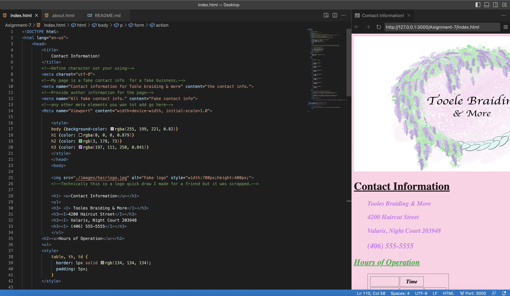

I have come across all sorts of forms within my web browsing days. I have come across dropdown boxes, text entries, radio checkmarks, buttons, password inputs, and file uploads. All of these methods are used to keep websites organized, to lead you to where you want to go, and to collect data/ information of website users. Most websites (that I can recal) have all of these options if there are products to sell to users. Most all of these forms are on every website thoguh for many different purposes. 
