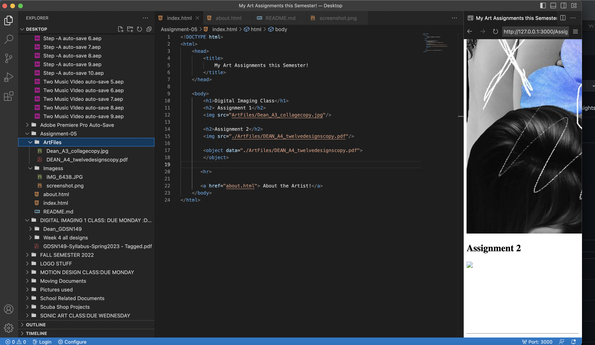

#1. I visited youtube from  the year 2006. The older version is mostly al links, terrible descriptions, and I could fin much for photos of certain videos either. It must have been hard to find videos without thepicture showing which video it was. There wasnt any choices for a library, of to save videos, or be able to make playlists.(or at least I could find those options).
