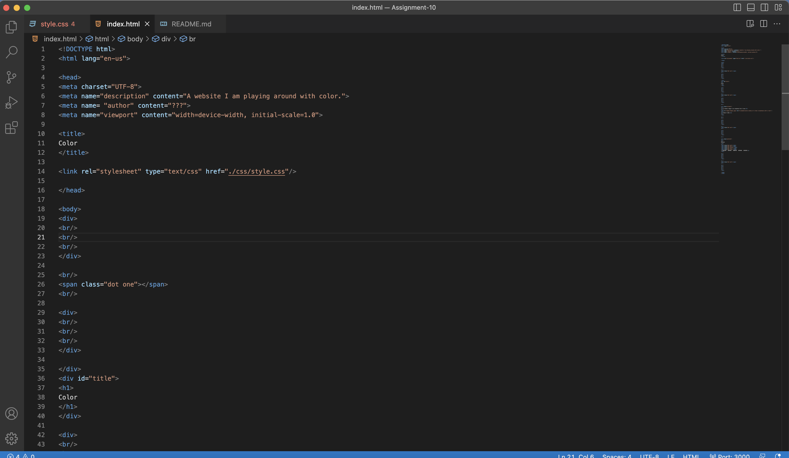

The universal selector is used to style every element on a page,The element selector is used to select all elements of a certain type and is applied by simply using an element name,Class names assigned to HTML elements and attribute can also be used to style elements. Using class selectors is a great way to select elements that serve the same function.
You would use universal selector if you want everything on your page to look excatly the same. You would use the element selector to only make elements the same. You would use class selestors to make everything that functions the same way, to look the same.
I chose my color pallete from a really pretty image from a movie I love. I chose the colors by using one of the websites, entering my image, and finding the ebst looking colors to go together.
The challenges I faced were getting my div elements and my image to be the size I wanted them to be. They always wanted to be their own size.
