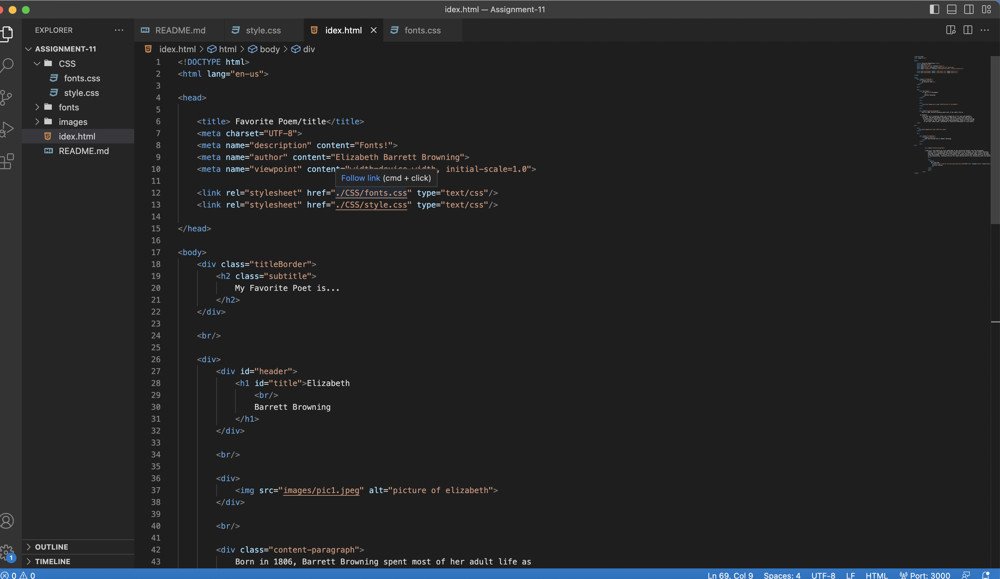

Typography is one of the most important skill-sets for a designer and web developer. It is how you convey most of the information you will be presenting. It is the way you present,oraganize, and stlye the words and letters in your website.

The importance is that some different computer types do not have all the same fonts, so having fall back fonts gives different types of computers different fonts to try incase the first one is not available.

System fonts are those already installed on your local device and system. These are available to you and most programs you use, but are not necessarily to the web. 
Web fonts are custom fonts hosted on a server. They do not have to be available on the user's device to appear, but require certain elements to get called up correctly.
Fonts that developers can count on being available by the system are known as "web-safe" fonts. These include font families that both Windows and Mac should have
