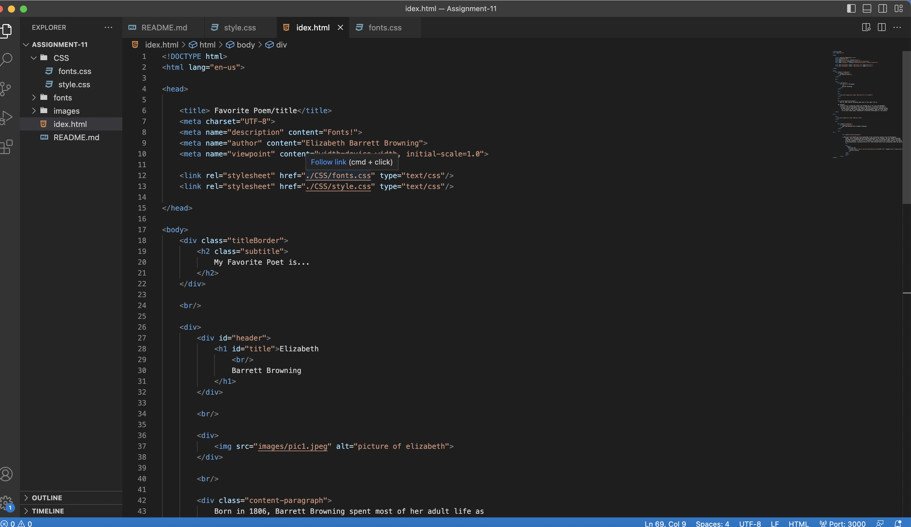

Boarder:The Borders help define the amount of space a box or element takes up, as well as its relationship to other boxes. The border portion of the box can be separately colored, and has multiple style options. The Border is more of a visual styling tool, than a space management tool.

Padding:Padding is the amount of space between the inner content of the element and the element itself. The Padding creates space between the text and the box border/edge. Padding is used to get elements to be shown without containing content

Margin:Margin is the space between the box/element and other elements, or the edge of the parent element. The Margin accepts both absolute and relative size units like the padding.

It went ok, But many of the stylizing tools didnt work, and I couldnt figure them out while I was away on vacation. Hoping I can fix them through a zoom meeting.

