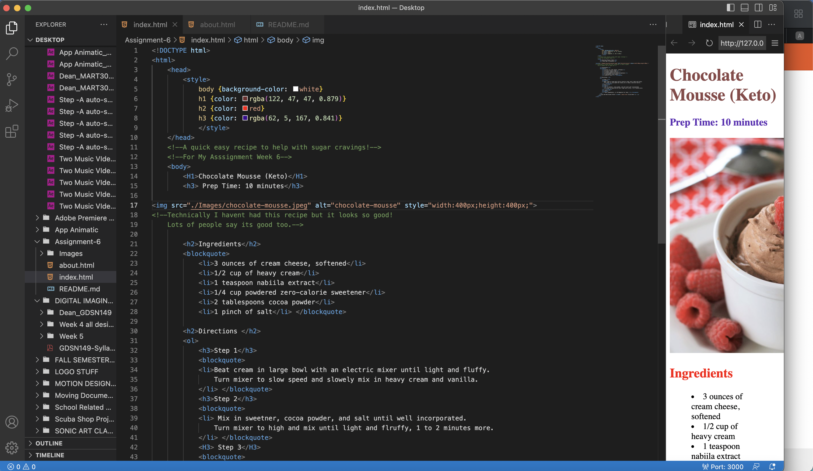

Within the body element(the data that is rendered by the browser and displayed on computer), there are two types of markup used.
1. Structural markup: embeds information about the structure of a document. (The structure includes the headings,paragraphs,breaks, and lists). These are visual guides for the user.
2. Semantic markup: is used to reinforce the semantics(the meaning) of information of a document. (These include emphasis,the strong, citations, quotes, link defenitions, and editorial changes)
 