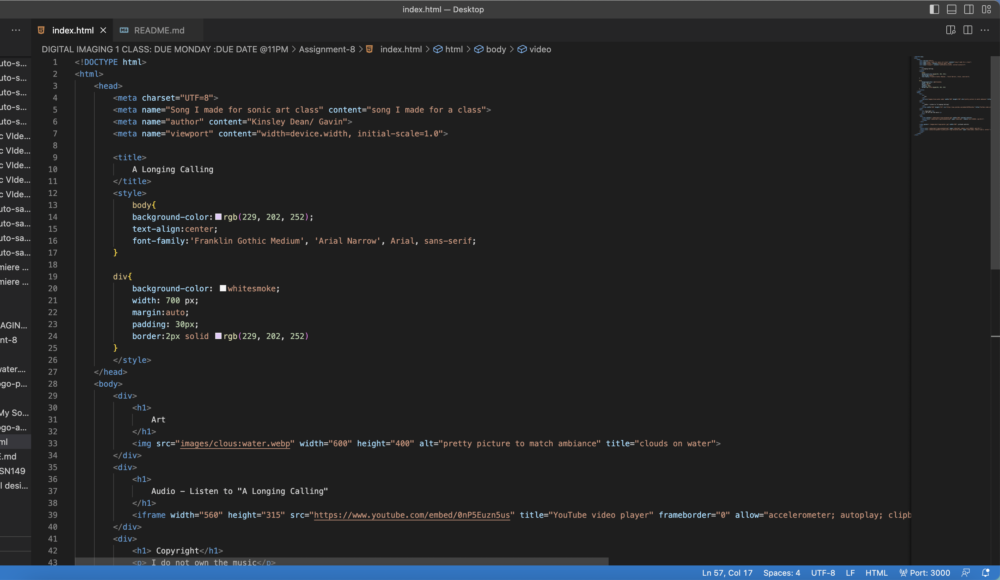

Affordance is the relationship between a person and a digital object. They are perceivable, actionable possibilities. An example is buttons. Users know that buttons can be pushed, so the likelyhood of a user pushing a button is the buttons affordance.(how an oject would be used/what it deos).

Disadvantages of third party-not all sites will work in an iframe, must have creative commons cc, 
Advatages to self hosted-own the video files, the video element allows you to add a functioning player to your website, much less coding is needed to be done.

