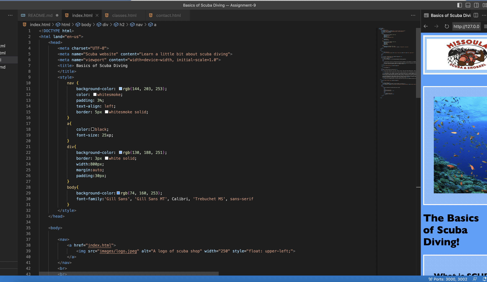

My learning experience this semester has been slow and hard. As I am new to this, it defenitly took me some time to understand what everything means, and to remember what it all does without having to look it up every single time. As the weeks have gone on it has gotten eaier to remember the most basic stuff. I am still remembering how to write the code for the more conplicated stuff like images, videos, divs, and navs. This assignment helped me get more in the hang of using them though. It has been interestng to learn about all of it this semester. I hope I can use this in the future, for my own projects and websites if I ever need them!
I am excitedto learn to decorate websites. I love decorating things in general like art or living spaces. In so, I am looking forward on being able to decorate the websites and use it to my advantage in the future as well.

