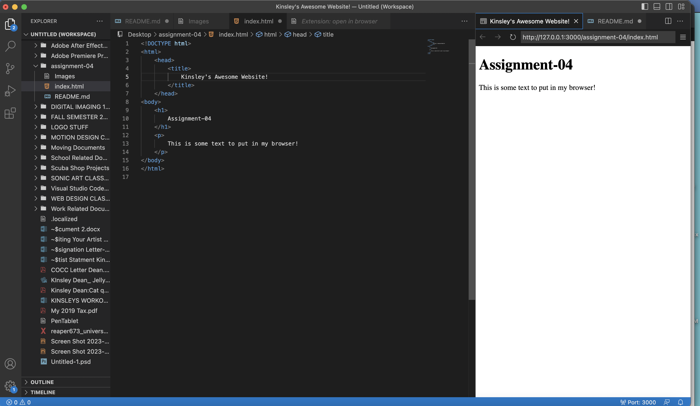

Browsers send a request from your computer to servers. These servers then find and send the web content back to the browser, who interprets the content with a rendering engine, a browser engine, and a javasccript interpreter. The browser then displays the page on the screen of your computer.

